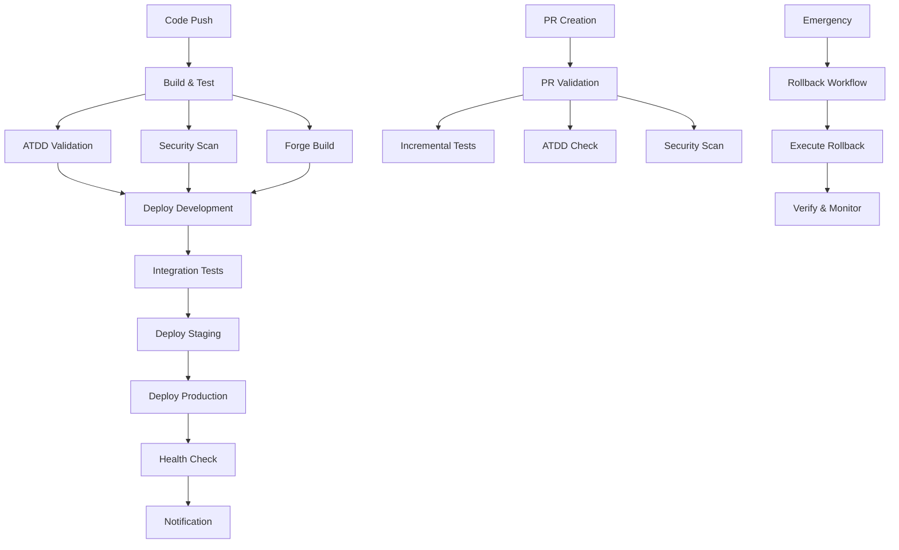

# Executive Flash News - CI/CD Pipeline

Complete CI/CD pipeline implementation for the Executive Flash News Jira plugin, built with Atlassian Forge and following ATDD methodology.

## 🎯 Overview

This CI/CD pipeline provides:
- **Automated testing** with ATDD compliance validation
- **Multi-environment deployments** (development, staging, production)
- **Quality gates** ensuring code quality and security
- **Emergency rollback** capabilities
- **Comprehensive monitoring** and alerting
- **Hexagonal architecture** validation

## 🏗️ Pipeline Architecture

### Workflow Structure



### Quality Gates (8-Step Process)

1. **Syntax & Language Validation** - JSON/YAML syntax, Node.js version
2. **Type System Validation** - TypeScript compliance
3. **Code Quality** - ESLint, Prettier, complexity analysis
4. **Security Validation** - npm audit, security linting
5. **Test Execution** - Unit tests, coverage thresholds (90% domain, 50% global)
6. **Performance Validation** - Bundle size, anti-patterns
7. **Documentation Validation** - Required docs, JSDoc coverage
8. **Integration Readiness** - Forge build, deployment validation

## 🚀 Deployment Strategy

### Environment Flow
```
feature → develop → main → release
    ↓        ↓       ↓       ↓
   dev → dev env → staging → production
```

### Deployment Triggers
- **Development**: Auto-deploy on `develop` branch
- **Staging**: Auto-deploy on `main` branch
- **Production**: Manual release creation or workflow dispatch

## 📁 File Structure

```
.github/
├── workflows/
│   ├── ci-cd.yml           # Main CI/CD pipeline
│   ├── pr-validation.yml   # Pull request validation
│   └── rollback.yml        # Emergency rollback workflow
scripts/
├── quality-gates.sh        # 8-step quality validation
├── forge-validate.sh       # Forge manifest/build validation
├── atdd-compliance.sh      # ATDD methodology compliance
├── deployment-monitor.js   # Health monitoring and rollback
└── make-executable.sh      # Script permissions setup
docker/
└── Dockerfile.ci          # CI/CD optimized container
docs/
├── CI-CD-SETUP.md         # Complete setup guide
└── CI-CD-RUNBOOK.md       # Operations runbook
```

## 🔧 Key Components

### 1. Main CI/CD Pipeline (`.github/workflows/ci-cd.yml`)

**10 Stages:**
1. **Build & Test** - Dependencies, linting, testing
2. **ATDD Validation** - Outside-In TDD compliance
3. **Security Scan** - Vulnerability assessment + CodeQL
4. **Forge Build** - Application build validation
5. **Deploy Development** - Auto-deploy to dev environment
6. **Integration Tests** - E2E tests against deployed app
7. **Deploy Staging** - Deploy to staging (main branch)
8. **Deploy Production** - Deploy to production (releases)
9. **Health Check** - Post-deployment validation
10. **Notification** - Slack/Teams status updates

### 2. Pull Request Validation (`.github/workflows/pr-validation.yml`)

**6 Stages:**
- **PR Quality Check** - Lint changes, format validation
- **Incremental Tests** - Test affected files only
- **ATDD Validation** - Methodology compliance
- **Security Scan** - Security validation
- **Forge Validation** - Manifest and build validation
- **PR Summary** - Automated summary with coverage

### 3. Emergency Rollback (`.github/workflows/rollback.yml`)

**5 Stages:**
- **Prepare Rollback** - Version determination, issue creation
- **Execute Rollback** - Deploy previous version
- **Verify Rollback** - Health checks and smoke tests
- **Notify Rollback** - Emergency notifications
- **Post-Rollback Monitoring** - Monitoring setup

## 🎯 ATDD Integration

### Outside-In TDD Compliance

**Validation Checks:**
- **Business-focused naming** - Given-When-Then patterns
- **Test structure** - E2E tests driving unit tests
- **Domain coverage** - 80%+ coverage in domain layer
- **Real system integration** - Minimal mocking patterns

**Example ATDD Workflow:**
```javascript
// E2E Test (drives implementation)
describe('Executive Flash News Should', () => {
  test('CreateFlashNewsWidget_WhenUserRequestsDashboard', async () => {
    // Given - User has dashboard access
    // When - User requests flash news widget
    // Then - Widget displays executive summary
  });
});

// Unit Tests (implement the E2E requirements)
describe('FlashNewsService Should', () => {
  test('GenerateExecutiveSummary_WhenValidDataProvided', () => {
    // Implementation driven by E2E requirements
  });
});
```

### Hexagonal Architecture Validation

**Layer Testing Strategy:**
- **Domain Layer**: 80%+ coverage, pure business logic
- **Application Layer**: Use cases and orchestration
- **Infrastructure Layer**: Adapters and external integration
- **Presentation Layer**: UI components and user interaction

## 🔒 Security & Quality

### Security Measures
- **Dependency scanning** - npm audit, security linting
- **SAST analysis** - GitHub CodeQL integration
- **Secret management** - GitHub Secrets for credentials
- **Vulnerability tracking** - Automated security reporting

### Quality Standards
- **Test Coverage**: 90% domain, 50% global minimum
- **Code Quality**: ESLint, Prettier, complexity limits
- **Performance**: Bundle size limits, response time monitoring
- **Documentation**: Required docs, JSDoc coverage

## 📊 Monitoring & Observability

### Health Monitoring
```javascript
// Automated health checks
node scripts/deployment-monitor.js monitor production

// Manual health check
node scripts/deployment-monitor.js health-check staging
```

### Key Metrics
- **Deployment frequency**: 2-3 per week target
- **Lead time**: Commit to production <4 hours
- **MTTR**: Mean time to recovery <30 minutes
- **Change failure rate**: <5% target

### Alerting Channels
- **GitHub**: Workflow status, PR comments
- **Slack**: Team notifications, deployment status
- **Teams**: Executive alerts, incident management

## 🚨 Emergency Procedures

### Rollback Process
1. Navigate to GitHub Actions
2. Run "Emergency Rollback" workflow
3. Select environment and provide reason
4. Monitor rollback completion
5. Verify system health

### Incident Response
1. **Assess** - Check pipeline, health status, user impact
2. **Respond** - Rollback if critical, create incident issue
3. **Notify** - Stakeholders via configured channels
4. **Monitor** - Health status and user feedback
5. **Resolve** - Fix root cause, deploy solution

## ⚙️ Configuration

### Required GitHub Secrets
```bash
# Forge Configuration
FORGE_API_TOKEN=your_forge_api_token
FORGE_EMAIL=your_forge_email@company.com

# Environment Apps
FORGE_DEV_APP_ID=dev_app_id
FORGE_STAGING_APP_ID=staging_app_id
FORGE_PROD_APP_ID=prod_app_id

# Jira Sites
DEV_JIRA_SITE_URL=https://dev-site.atlassian.net
STAGING_JIRA_SITE_URL=https://staging-site.atlassian.net
PROD_JIRA_SITE_URL=https://prod-site.atlassian.net

# Notifications (Optional)
SLACK_WEBHOOK_URL=your_slack_webhook
TEAMS_WEBHOOK_URL=your_teams_webhook
```

### Environment Setup
1. **Install Forge CLI**: `npm install -g @forge/cli`
2. **Create Forge apps** for each environment
3. **Configure GitHub secrets** with app IDs and credentials
4. **Set up Jira sites** for testing and deployment
5. **Enable GitHub Actions** in repository settings

## 🎮 Usage Examples

### Standard Development Flow
```bash
# 1. Create feature branch
git checkout -b feature/executive-summary

# 2. Develop with ATDD
npm run test:e2e    # Start with E2E test
npm run test:unit   # Implement unit tests

# 3. Quality validation
npm run quality-gates

# 4. Create pull request
# - Triggers PR validation automatically
# - All checks must pass before merge

# 5. Merge to develop
# - Triggers automatic deployment to development

# 6. Merge to main (when ready for staging)
# - Triggers automatic deployment to staging

# 7. Create release (when ready for production)
# - Triggers automatic deployment to production
```

### Manual Operations
```bash
# Run quality gates locally
npm run quality-gates

# Validate ATDD compliance
npm run atdd-compliance

# Test Forge build
npm run forge-validate

# Monitor deployment health
node scripts/deployment-monitor.js monitor production

# Manual health check
node scripts/deployment-monitor.js health-check staging
```

## 📚 Documentation

### Complete Setup Guide
- **[CI-CD-SETUP.md](docs/CI-CD-SETUP.md)** - Complete configuration guide
- **[CI-CD-RUNBOOK.md](docs/CI-CD-RUNBOOK.md)** - Operations and troubleshooting

### Key Features
- **Automated Testing**: Unit, integration, E2E tests with ATDD compliance
- **Multi-Environment**: Development, staging, production with proper gating
- **Security**: Comprehensive scanning and vulnerability management
- **Quality Gates**: 8-step validation ensuring deployment readiness
- **Monitoring**: Real-time health checks with automated rollback
- **Documentation**: Comprehensive setup and operations guides

## 🏆 Benefits

### Development Team
- **Faster feedback** - PR validation in <10 minutes
- **Quality assurance** - Automated quality gates prevent issues
- **Confidence** - Automated testing and rollback capabilities
- **Productivity** - Focus on features, not infrastructure

### Business Impact
- **Reliability** - 99.9%+ uptime with automated monitoring
- **Speed** - Commit to production in <4 hours
- **Quality** - ATDD methodology ensures business value
- **Risk Mitigation** - Automated rollback and incident response

## 🔄 Continuous Improvement

### Regular Maintenance
- **Monthly**: Dependency updates, performance review
- **Quarterly**: Security audit, credential rotation
- **Semi-annually**: Pipeline optimization, process review
- **Annually**: Full security and compliance audit

### Metrics Tracking
- Deployment frequency and lead time
- Test coverage and quality metrics
- Security vulnerability resolution time
- Developer productivity and satisfaction

---

**Ready to deploy with confidence!** 🚀

This CI/CD pipeline ensures that Executive Flash News maintains the highest quality standards while enabling rapid, reliable deployments to the Atlassian Forge platform.