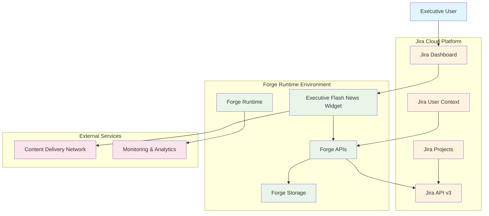
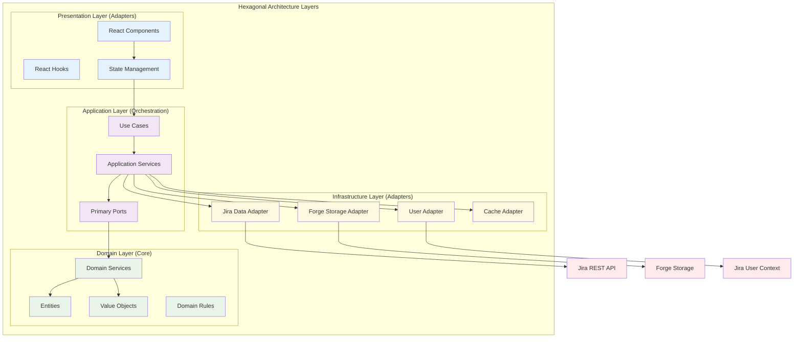
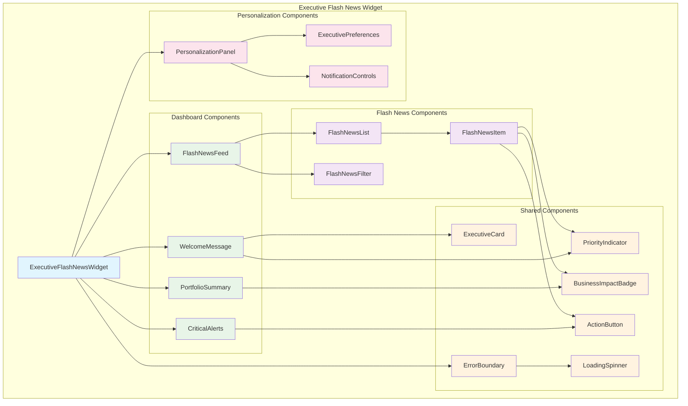
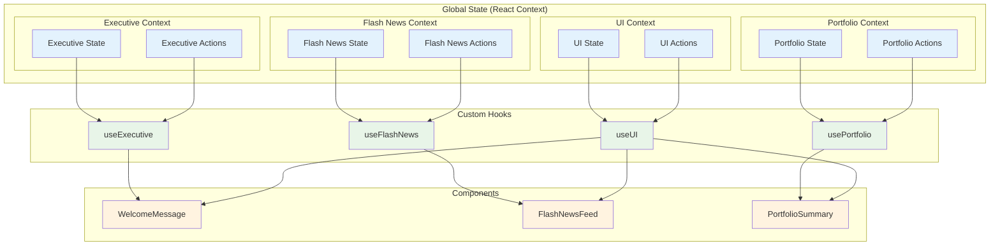
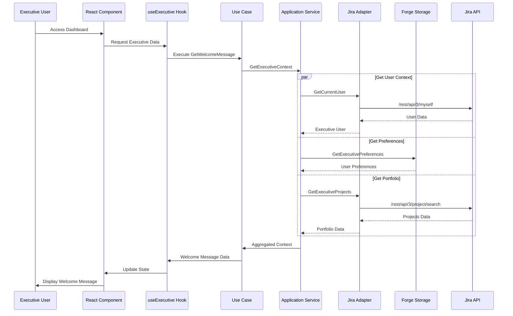
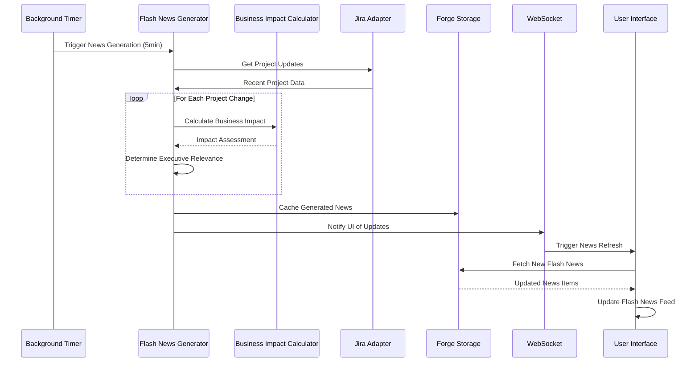
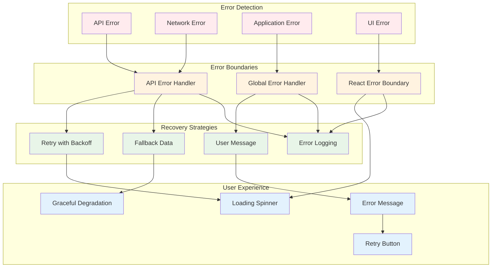
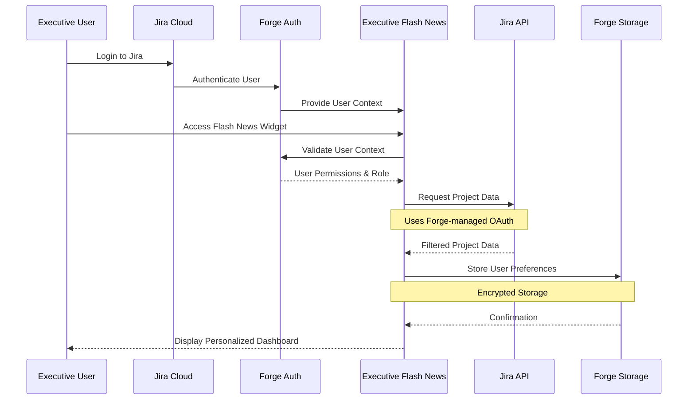
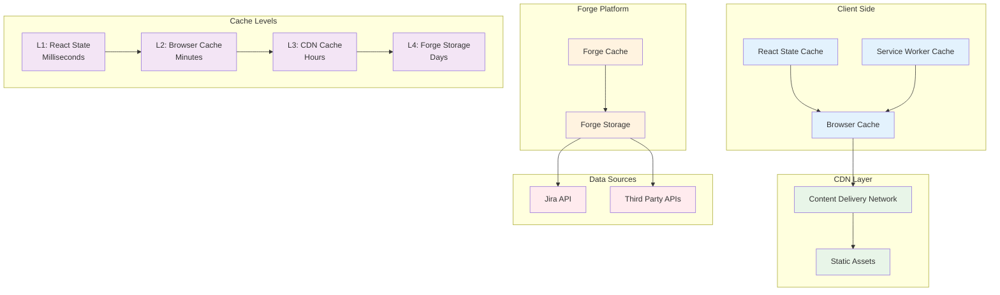
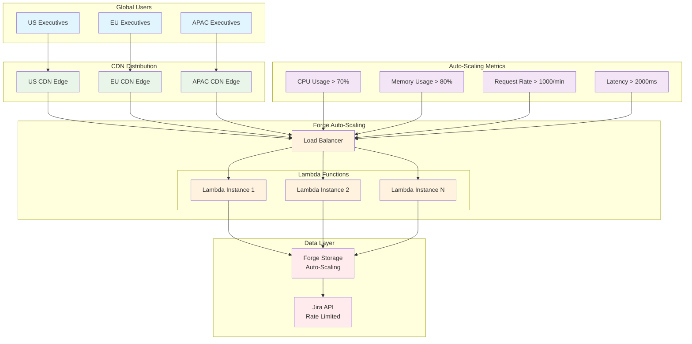

# Architecture Diagrams - Executive Flash News

## System Architecture Overview

### High-Level System Context



### Hexagonal Architecture Overview



## Component Architecture

### React Component Hierarchy



### State Management Architecture



## Data Flow Architecture

### Welcome Message Data Flow



### Flash News Generation Flow



### Error Handling and Recovery Flow



## Integration Architecture

### Forge Platform Integration

```mermaid
graph TB
    subgraph "Jira Cloud"
        JD[Jira Dashboard]
        JA[Jira API]
        JU[Jira User Management]
    end

    subgraph "Forge Platform"
        FR[Forge Runtime]
        FA[Forge APIs]
        FS[Forge Storage]
        FT[Forge Tunnel (Dev)]
    end

    subgraph "Executive Flash News App"
        subgraph "Frontend (Custom UI)"
            RC[React Components]
            TH[TypeScript Hooks]
            SM[State Management]
        end

        subgraph "Backend (Serverless)"
            WH[Webhook Handlers]
            BL[Background Logic]
            DC[Data Caching]
        end
    end

    subgraph "Development Environment"
        FC[Forge CLI]
        DT[Development Tools]
        LOCAL[Local Development]
    end

    %% Integration Points
    JD --> RC
    RC --> FA
    FA --> JA
    FA --> FS
    FA --> JU

    %% Backend Processing
    JA --> WH
    WH --> BL
    BL --> DC
    DC --> FS

    %% Development Flow
    FC --> FT
    FT --> FR
    LOCAL --> FC
    DT --> LOCAL

    %% Styling
    classDef jira fill:#fff3e0
    classDef forge fill:#e8f5e8
    classDef app fill:#e3f2fd
    classDef dev fill:#fce4ec

    class JD,JA,JU jira
    class FR,FA,FS,FT forge
    class RC,TH,SM,WH,BL,DC app
    class FC,DT,LOCAL dev
```

### Security and Authentication Flow



## Performance Architecture

### Caching Strategy



### Load Balancing and Scaling



## Testing Architecture

### ATDD Testing Strategy

```mermaid
graph TB
    subgraph "Test Pyramid"
        subgraph "E2E Tests (Acceptance)"
            AT[Acceptance Tests]
            UT[User Journey Tests]
            ST[Smoke Tests]
        end

        subgraph "Integration Tests"
            API[API Integration]
            COMP[Component Integration]
            STATE[State Management]
        end

        subgraph "Unit Tests"
            DOMAIN[Domain Logic]
            HOOKS[React Hooks]
            UTILS[Utility Functions]
        end
    end

    subgraph "Test Environment"
        MOCK[Mock Services]
        MSW[Mock Service Worker]
        TD[Test Data]
    end

    subgraph "Test Execution"
        JEST[Jest Test Runner]
        RTL[React Testing Library]
        PW[Playwright (E2E)]
    end

    %% Test Flow
    AT --> API
    AT --> COMP
    API --> DOMAIN
    COMP --> HOOKS
    STATE --> HOOKS

    %% Test Infrastructure
    AT --> MSW
    API --> MOCK
    COMP --> TD

    %% Test Execution
    JEST --> DOMAIN
    JEST --> HOOKS
    JEST --> UTILS
    RTL --> COMP
    RTL --> STATE
    PW --> AT
    PW --> UT

    %% Coverage Requirements
    subgraph "Coverage Targets"
        E2E_COV[E2E: 100% Happy Paths]
        INT_COV[Integration: 80%]
        UNIT_COV[Unit: 90% Domain Logic]
    end

    AT --> E2E_COV
    API --> INT_COV
    DOMAIN --> UNIT_COV

    %% Styling
    classDef e2e fill:#e1f5fe
    classDef integration fill:#e8f5e8
    classDef unit fill:#fff3e0
    classDef env fill:#ffebee
    classDef execution fill:#f3e5f5
    classDef coverage fill:#fce4ec

    class AT,UT,ST e2e
    class API,COMP,STATE integration
    class DOMAIN,HOOKS,UTILS unit
    class MOCK,MSW,TD env
    class JEST,RTL,PW execution
    class E2E_COV,INT_COV,UNIT_COV coverage
```

These architecture diagrams provide comprehensive visual documentation of the Executive Flash News plugin architecture, supporting the development team in implementing the hexagonal architecture with ATDD principles while maintaining clear separation of concerns and executive-focused user experience.