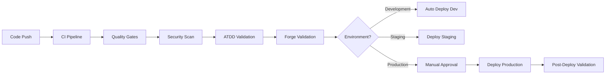

# CI/CD Pipeline Setup Guide

## Executive Flash News - Comprehensive CI/CD Configuration

This guide provides step-by-step instructions for setting up the complete CI/CD pipeline for the Executive Flash News Jira plugin.

## Table of Contents

1. [Overview](#overview)
2. [Prerequisites](#prerequisites)
3. [GitHub Secrets Configuration](#github-secrets-configuration)
4. [Environment Setup](#environment-setup)
5. [Pipeline Configuration](#pipeline-configuration)
6. [Quality Gates](#quality-gates)
7. [Deployment Workflow](#deployment-workflow)
8. [Troubleshooting](#troubleshooting)

## Overview

### Pipeline Architecture



### Key Features

- **8-Step Quality Gates**: Comprehensive validation before deployment
- **ATDD Compliance**: Outside-In TDD methodology enforcement
- **Multi-Environment**: Development, Staging, Production deployments
- **Security-First**: Vulnerability scanning and audit checks
- **Rollback Capability**: Automated rollback on deployment failures

## Prerequisites

### Required Tools

1. **Node.js 18.x+**
   ```bash
   node --version  # Should be 18.x or higher
   ```

2. **Forge CLI**
   ```bash
   npm install -g @forge/cli
   forge --version
   ```

3. **Git with proper configuration**
   ```bash
   git config user.name "Your Name"
   git config user.email "your-email@company.com"
   ```

### Required Accounts

- **GitHub Account** with repository access
- **Atlassian Developer Account** with Forge access
- **Jira Sites** for each environment (dev, staging, prod)

## GitHub Secrets Configuration

### Step 1: Access Repository Secrets

1. Navigate to your GitHub repository
2. Go to **Settings** → **Secrets and Variables** → **Actions**
3. Click **New repository secret**

### Step 2: Configure Required Secrets

#### Forge Authentication

```yaml
# Primary Forge API Token
FORGE_API_TOKEN: "your-forge-api-token"
```

**How to get Forge API Token:**
1. Go to [Atlassian Developer Console](https://developer.atlassian.com/console/myapps/)
2. Select your app or create a new one
3. Go to **Settings** → **API tokens**
4. Generate new token
5. Copy the token value

#### Environment-Specific App IDs

```yaml
# Development Environment
FORGE_DEV_APP_ID: "ari:cloud:ecosystem::app/your-dev-app-id"

# Staging Environment
FORGE_STAGING_APP_ID: "ari:cloud:ecosystem::app/your-staging-app-id"

# Production Environment
FORGE_PROD_APP_ID: "ari:cloud:ecosystem::app/your-production-app-id"
```

**How to get App IDs:**
```bash
# Login to Forge CLI
forge login

# List your apps
forge list

# Copy the App ID from the output
```

#### Optional Notification Secrets

```yaml
# Slack Notifications (optional)
SLACK_WEBHOOK_URL: "https://hooks.slack.com/services/..."

# Teams Notifications (optional)
TEAMS_WEBHOOK_URL: "https://outlook.office.com/webhook/..."

# Email Notifications (optional)
NOTIFICATION_EMAIL: "team@company.com"
```

### Step 3: Environment-Specific Secrets

For each environment (development, staging, production), configure:

#### Development Environment
- Environment name: `development`
- URL: Your development Jira site
- Secrets: `FORGE_DEV_APP_ID`

#### Staging Environment
- Environment name: `staging`
- URL: Your staging Jira site
- Secrets: `FORGE_STAGING_APP_ID`

#### Production Environment
- Environment name: `production`
- URL: Your production Jira site
- Secrets: `FORGE_PROD_APP_ID`
- **Protection Rules**: Require manual approval

## Environment Setup

### Step 1: Configure Local Development

```bash
# Clone repository
git clone https://github.com/your-org/executive-flash-news.git
cd executive-flash-news

# Copy environment template
cp .env.example .env

# Edit .env with your values
nano .env
```

### Step 2: Forge CLI Setup

```bash
# Authenticate with Forge
forge login

# Verify authentication
forge whoami

# List available sites
forge list
```

### Step 3: Create Forge Apps for Each Environment

#### Development App
```bash
# Create development app
forge create --name "Executive Flash News (Dev)" --template custom-ui-jira-dashboard-item

# Note the App ID for GitHub secrets
forge list
```

#### Staging App
```bash
# Create staging app
forge create --name "Executive Flash News (Staging)" --template custom-ui-jira-dashboard-item

# Note the App ID for GitHub secrets
forge list
```

#### Production App
```bash
# Create production app
forge create --name "Executive Flash News" --template custom-ui-jira-dashboard-item

# Note the App ID for GitHub secrets
forge list
```

## Pipeline Configuration

### Continuous Integration (CI)

The CI pipeline runs on every push and pull request:

#### Triggered by:
- Push to `main` or `develop` branches
- Pull requests to `main` or `develop` branches

#### Pipeline Stages:

1. **Build & Validation** (≤5 min)
   - Node.js setup and dependency installation
   - TypeScript compilation
   - ESLint validation
   - Forge build validation

2. **ATDD Compliance** (≤5 min)
   - Outside-In TDD structure validation
   - One E2E test rule enforcement
   - BDD scenario structure check
   - Scaffolding pattern validation

3. **Test Execution** (≤8 min)
   - Unit tests with coverage
   - Integration tests
   - E2E acceptance tests
   - Coverage threshold validation

4. **Security & Quality** (≤10 min)
   - npm audit for vulnerabilities
   - 8-step quality gates validation
   - Code quality metrics
   - Documentation validation

5. **Forge Validation** (≤10 min)
   - Forge CLI validation
   - Manifest structure check
   - Build artifacts validation
   - Permissions validation

### Continuous Deployment (CD)

The CD pipeline handles environment-specific deployments:

#### Deployment Triggers:

- **Development**: Automatic on `develop` branch push
- **Staging**: Automatic on `main` branch push or PR merge
- **Production**: Manual approval required

#### Deployment Process:

1. **Pre-deployment Checks**
   - Full CI pipeline validation
   - Environment-specific configuration
   - Security scanning

2. **Forge Deployment**
   - Forge CLI authentication
   - Build artifact generation
   - App deployment to target environment
   - Post-deployment verification

3. **Health Checks**
   - Smoke tests execution
   - Basic functionality validation
   - Performance monitoring

## Quality Gates

### 8-Step Validation Process

```bash
# Run complete quality gates locally
./scripts/quality-gates.sh
```

#### Step 1: Syntax Validation
- TypeScript compilation
- JSON/YAML validation
- Import/export verification

#### Step 2: Type Validation
- TypeScript type checking
- Dependency validation
- Interface compatibility

#### Step 3: Linting
- ESLint code quality
- Prettier formatting
- Code style consistency

#### Step 4: Security
- npm audit vulnerabilities
- Hardcoded secrets detection
- Security best practices

#### Step 5: Testing
- Unit test execution
- Coverage threshold validation
- Test quality metrics

#### Step 6: Performance
- Build time validation
- Bundle size analysis
- Performance benchmarks

#### Step 7: Documentation
- README validation
- Inline documentation
- API documentation

#### Step 8: Integration
- Forge integration validation
- Manifest compliance
- Deployment readiness

### ATDD Compliance Validation

```bash
# Run ATDD compliance check
./scripts/atdd-compliance.sh
```

- Outside-In TDD structure
- Acceptance test quality
- BDD scenario validation
- Customer collaboration evidence
- Real system integration

## Deployment Workflow

### Development Deployment

**Trigger**: Push to `develop` branch

```yaml
# Automatic process:
1. CI pipeline validation
2. Lightweight testing
3. Forge deployment to dev app
4. Basic smoke tests
```

**Access**: Available immediately at development Jira site

### Staging Deployment

**Trigger**: Push/merge to `main` branch

```yaml
# Automatic process:
1. Full CI pipeline validation
2. Comprehensive testing
3. Forge deployment to staging app
4. Integration smoke tests
5. Performance validation
```

**Access**: Available at staging Jira site after validation

### Production Deployment

**Trigger**: Manual approval in GitHub Actions

```yaml
# Manual process:
1. Full CI pipeline validation
2. Security audit
3. Manual approval required
4. Forge deployment to production app
5. Comprehensive post-deployment validation
6. Monitoring and alerting
```

**Access**: Available at production Jira site

### Manual Deployment

For emergency deployments or specific environments:

```bash
# Using GitHub Actions workflow dispatch
1. Go to Actions tab in GitHub
2. Select "Forge Deployment Workflow"
3. Click "Run workflow"
4. Select environment
5. Configure options
6. Run deployment
```

## Rollback Procedures

### Automatic Rollback

Triggered automatically on deployment failures:

1. **Detection**: Post-deployment validation fails
2. **Initiation**: Automatic rollback procedure
3. **Restoration**: Previous app version restored
4. **Notification**: Team notification of rollback

### Manual Rollback

For emergency situations:

```bash
# Using Forge CLI
forge deploy --app your-app-id --version previous-version

# Using GitHub Actions
# Trigger rollback workflow from Actions tab
```

## Monitoring and Alerting

### Built-in Monitoring

- **Build Status**: GitHub Actions status badges
- **Test Results**: Coverage reports and test summaries
- **Deployment Status**: Environment-specific deployment tracking
- **Quality Metrics**: Code quality and security dashboards

### Optional Integrations

- **Slack**: Deployment notifications and alerts
- **Teams**: Team collaboration and status updates
- **Email**: Critical failure notifications
- **Custom Webhooks**: Integration with monitoring tools

## Troubleshooting

### Common Issues

#### CI Pipeline Failures

**Issue**: Tests failing in CI but passing locally
```bash
# Solution: Ensure environment parity
npm ci  # Use exact dependency versions
npm test -- --passWithNoTests --verbose
```

**Issue**: Build timeouts
```bash
# Solution: Check build performance
npm run build -- --verbose
# Optimize build process if necessary
```

#### Deployment Failures

**Issue**: Forge authentication fails
```bash
# Solution: Verify GitHub secrets
# Re-generate Forge API token if necessary
```

**Issue**: App ID not found
```bash
# Solution: Verify app ID in secrets
forge list  # Confirm app exists
```

**Issue**: Manifest validation errors
```bash
# Solution: Run local validation
forge lint
./scripts/forge-validate.sh
```

#### ATDD Compliance Issues

**Issue**: Multiple E2E tests active
```bash
# Solution: Follow one-E2E-at-a-time rule
# Use [Ignore] attribute for unimplemented scenarios
```

**Issue**: Missing acceptance tests
```bash
# Solution: Create E2E tests for main user scenarios
# Follow Given-When-Then structure
```

### Debug Commands

```bash
# Debug CI pipeline locally
npm run build
npm run test:coverage
npm run lint
./scripts/quality-gates.sh

# Debug Forge integration
forge lint
forge build
./scripts/forge-validate.sh

# Debug ATDD compliance
./scripts/atdd-compliance.sh
```

### Getting Help

1. **Documentation**: Check this guide and inline comments
2. **Logs**: Review GitHub Actions logs for detailed error messages
3. **Community**: Forge developer community and documentation
4. **Support**: Atlassian Developer Support for Forge-specific issues

## Security Best Practices

### Secret Management

- Use GitHub Secrets for all sensitive data
- Rotate API tokens regularly
- Use different tokens for each environment
- Never commit secrets to version control

### Access Control

- Implement branch protection rules
- Require code reviews for production deployments
- Use environment-specific approval workflows
- Monitor and audit deployment activities

### Security Scanning

- Regular vulnerability scanning with npm audit
- Dependency security monitoring
- Code security analysis
- Runtime security monitoring

## Maintenance

### Regular Tasks

- **Weekly**: Review pipeline performance and logs
- **Monthly**: Update dependencies and security patches
- **Quarterly**: Review and rotate API tokens
- **Annually**: Audit and optimize pipeline configuration

### Updates

- Monitor Forge CLI updates
- Update GitHub Actions versions
- Review and update quality gates
- Optimize pipeline performance

## Conclusion

This CI/CD pipeline provides comprehensive automation for the Executive Flash News Jira plugin while maintaining high quality standards through ATDD methodology and rigorous validation. Regular monitoring and maintenance ensure continued reliability and performance.

For questions or issues, refer to the troubleshooting section or consult the team documentation.