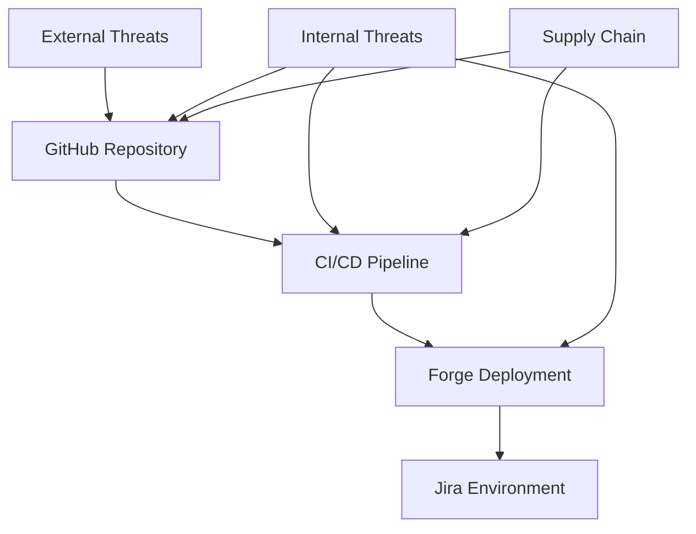

# Security Best Practices for CI/CD Pipeline

## Executive Flash News - Security Guidelines

This document outlines security best practices for the CI/CD pipeline and Forge deployment process.

## Table of Contents

1. [Overview](#overview)
2. [Secret Management](#secret-management)
3. [Access Control](#access-control)
4. [Forge Security](#forge-security)
5. [Pipeline Security](#pipeline-security)
6. [Code Security](#code-security)
7. [Monitoring & Auditing](#monitoring--auditing)
8. [Incident Response](#incident-response)

## Overview

### Security Principles

- **Defense in Depth**: Multiple layers of security controls
- **Least Privilege**: Minimal required permissions
- **Zero Trust**: Verify everything, trust nothing
- **Continuous Monitoring**: Real-time security monitoring
- **Rapid Response**: Quick incident detection and response

### Threat Model



## Secret Management

### GitHub Secrets

#### Repository Secrets Configuration

```yaml
# Required Secrets (Repository Level)
FORGE_API_TOKEN: "API token for Forge CLI"
FORGE_DEV_APP_ID: "Development app identifier"
FORGE_STAGING_APP_ID: "Staging app identifier"
FORGE_PROD_APP_ID: "Production app identifier"

# Optional Notification Secrets
SLACK_WEBHOOK_URL: "Slack integration webhook"
TEAMS_WEBHOOK_URL: "Teams integration webhook"
NOTIFICATION_EMAIL: "Alert notification email"
```

#### Environment-Specific Secrets

```yaml
# Development Environment
development:
  url: "https://dev-site.atlassian.net"
  secrets:
    - FORGE_DEV_APP_ID

# Staging Environment
staging:
  url: "https://staging-site.atlassian.net"
  secrets:
    - FORGE_STAGING_APP_ID

# Production Environment
production:
  url: "https://production-site.atlassian.net"
  protection_rules:
    required_reviewers: 2
    prevent_secrets_bypass: true
  secrets:
    - FORGE_PROD_APP_ID
```

#### Secret Rotation Policy

**API Tokens**: Rotate every 90 days
```bash
# Automated rotation process
1. Generate new token in Atlassian Console
2. Update GitHub repository secret
3. Verify pipeline functionality
4. Deactivate old token
5. Document rotation in security log
```

**App IDs**: Review annually or on major changes
```bash
# App ID security review
1. Verify app permissions and scopes
2. Review installed sites and users
3. Audit app activity logs
4. Update documentation
```

### Local Development Security

#### Environment File Security

```bash
# .env file security checklist
✅ Add .env to .gitignore
✅ Use .env.example template
✅ Never commit actual secrets
✅ Use different secrets per developer
✅ Rotate local secrets regularly
```

#### Developer Machine Security

```bash
# Security requirements
✅ Enable full disk encryption
✅ Use strong passwords/2FA
✅ Keep OS and tools updated
✅ Use antivirus/anti-malware
✅ Secure network connections (VPN)
```

## Access Control

### Repository Access Control

#### Branch Protection Rules

```yaml
main:
  protection_rules:
    - required_status_checks: true
    - enforce_admins: true
    - required_pull_request_reviews: 2
    - dismiss_stale_reviews: true
    - require_code_owner_reviews: true
    - required_linear_history: true
    - allow_force_pushes: false
    - allow_deletions: false

develop:
  protection_rules:
    - required_status_checks: true
    - required_pull_request_reviews: 1
    - dismiss_stale_reviews: true
```

#### Team Permissions

```yaml
# Recommended team structure
admin_team:
  permissions: admin
  members: ["security-lead", "tech-lead"]

maintainer_team:
  permissions: maintain
  members: ["senior-developers"]

developer_team:
  permissions: write
  members: ["developers"]

reviewer_team:
  permissions: read
  members: ["stakeholders", "qa-team"]
```

### Pipeline Access Control

#### Workflow Permissions

```yaml
# GitHub Actions permissions
permissions:
  contents: read          # Read repository contents
  actions: read          # Read workflow run information
  checks: write          # Write check run results
  pull-requests: write   # Comment on pull requests
  security-events: write # Write security alerts

# Restricted permissions for production
production_permissions:
  contents: read         # No write access to code
  deployments: write     # Deploy to production only
```

#### Environment Protection

```yaml
# Production environment protection
production:
  required_reviewers: ["security-team", "tech-lead"]
  wait_timer: 5          # 5 minute wait period
  deployment_branches:   # Only from main branch
    - main
```

## Forge Security

### App Permissions

#### Minimal Permission Principle

```yaml
# manifest.yml - Minimal required permissions
permissions:
  scopes:
    - read:jira-user      # Read user information
    - read:jira-work      # Read work items
    # Avoid unnecessary permissions:
    # - write:jira-work   # Only if write access needed
    # - admin:jira        # Only for admin functions
```

#### Permission Audit Checklist

```bash
# Regular permission review
✅ Document why each permission is needed
✅ Review permissions quarterly
✅ Remove unused permissions
✅ Test functionality with minimal permissions
✅ Document permission usage in code
```

### App Security Configuration

#### Content Security Policy

```javascript
// Implement CSP in Forge app
const cspDirectives = {
  'default-src': ["'self'"],
  'script-src': ["'self'", "'unsafe-inline'"],
  'style-src': ["'self'", "'unsafe-inline'"],
  'img-src': ["'self'", "data:", "https:"],
  'connect-src': ["'self'"],
  'frame-ancestors': ["'none'"]
};
```

#### Input Validation

```javascript
// Example secure input handling
function sanitizeInput(userInput) {
  // Validate input format
  if (!userInput || typeof userInput !== 'string') {
    throw new Error('Invalid input format');
  }

  // Sanitize against XSS
  const sanitized = userInput
    .replace(/[<>]/g, '')
    .trim()
    .substring(0, 1000); // Limit length

  return sanitized;
}
```

### Jira Site Security

#### Site Access Control

```yaml
# Jira site security configuration
development_site:
  visibility: private
  user_access: team_only
  admin_access: limited

staging_site:
  visibility: private
  user_access: stakeholders
  admin_access: limited

production_site:
  visibility: controlled
  user_access: business_users
  admin_access: minimal
```

## Pipeline Security

### Dependency Security

#### Automated Vulnerability Scanning

```yaml
# Dependabot configuration (.github/dependabot.yml)
version: 2
updates:
  - package-ecosystem: "npm"
    directory: "/"
    schedule:
      interval: "weekly"
    reviewers:
      - "security-team"
    allow:
      - dependency-type: "production"
    ignore:
      - dependency-name: "*"
        update-types: ["version-update:semver-major"]
```

#### Security Audit Process

```bash
# Daily security checks
npm audit --audit-level moderate
npm audit fix --only=prod

# Weekly comprehensive audit
npm audit --audit-level low
npm outdated
```

### Build Security

#### Secure Build Process

```yaml
# Secure build pipeline steps
secure_build:
  steps:
    - name: "Verify Node.js version"
      run: |
        EXPECTED_VERSION="18"
        ACTUAL_VERSION=$(node --version | cut -d'.' -f1 | sed 's/v//')
        if [[ "$ACTUAL_VERSION" != "$EXPECTED_VERSION" ]]; then
          echo "Node.js version mismatch"
          exit 1
        fi

    - name: "Verify package integrity"
      run: |
        npm ci --audit-level moderate

    - name: "Scan for secrets"
      run: |
        # Basic secret scanning
        if grep -r "password\|secret\|token" src/ --exclude-dir=node_modules; then
          echo "Potential secrets found"
          exit 1
        fi
```

#### Artifact Security

```bash
# Build artifact verification
build_security_check() {
  # Verify build artifacts
  if [[ ! -d "static" ]]; then
    echo "Build artifacts missing"
    exit 1
  fi

  # Check for sensitive files
  find static/ -name "*.env*" -o -name "*secret*" -o -name "*key*" | while read file; do
    echo "Sensitive file found: $file"
    exit 1
  done

  # Verify file permissions
  find static/ -type f -perm /002 | while read file; do
    echo "World-writable file found: $file"
    exit 1
  done
}
```

### Deployment Security

#### Secure Deployment Process

```yaml
# Secure deployment configuration
secure_deployment:
  environment: production
  security_checks:
    - verify_authentication
    - validate_app_permissions
    - check_deployment_target
    - scan_for_vulnerabilities
    - verify_ssl_certificates
```

## Code Security

### Static Analysis

#### Security Scanning Integration

```yaml
# Security scanning in CI pipeline
security_scan:
  steps:
    - name: "Run security linting"
      run: |
        npx eslint src/ --ext .js,.ts --config .eslintrc.security.js

    - name: "Check for known vulnerabilities"
      run: |
        npx audit-ci --moderate

    - name: "Scan for secrets"
      uses: "trufflesecurity/trufflehog@main"
      with:
        path: "./"
        base: "main"
        head: "HEAD"
```

#### Code Quality Security

```javascript
// Security-focused ESLint configuration
module.exports = {
  extends: [
    'eslint:recommended',
    'plugin:security/recommended'
  ],
  plugins: ['security'],
  rules: {
    'security/detect-object-injection': 'error',
    'security/detect-non-literal-regexp': 'error',
    'security/detect-unsafe-regex': 'error',
    'security/detect-buffer-noassert': 'error',
    'security/detect-child-process': 'error',
    'security/detect-disable-mustache-escape': 'error',
    'security/detect-eval-with-expression': 'error',
    'security/detect-no-csrf-before-method-override': 'error',
    'security/detect-pseudoRandomBytes': 'error'
  }
};
```

### Secure Coding Practices

#### Input Validation

```javascript
// Secure input validation patterns
class InputValidator {
  static validateEmail(email) {
    const emailRegex = /^[^\s@]+@[^\s@]+\.[^\s@]+$/;
    return emailRegex.test(email) && email.length <= 254;
  }

  static sanitizeHtml(input) {
    return input.replace(/[<>&"']/g, function(match) {
      const escape = {
        '<': '&lt;',
        '>': '&gt;',
        '&': '&amp;',
        '"': '&quot;',
        "'": '&#x27;'
      };
      return escape[match];
    });
  }

  static validateJiraKey(key) {
    const jiraKeyRegex = /^[A-Z][A-Z0-9]*-[1-9][0-9]*$/;
    return jiraKeyRegex.test(key) && key.length <= 50;
  }
}
```

#### Error Handling

```javascript
// Secure error handling
class SecureErrorHandler {
  static handleApiError(error, context) {
    // Log detailed error internally
    console.error('API Error:', {
      message: error.message,
      stack: error.stack,
      context: context,
      timestamp: new Date().toISOString()
    });

    // Return safe error to client
    return {
      error: 'An error occurred processing your request',
      code: 'INTERNAL_ERROR',
      timestamp: new Date().toISOString()
    };
  }
}
```

## Monitoring & Auditing

### Security Monitoring

#### Automated Monitoring

```yaml
# Security monitoring configuration
monitoring:
  vulnerability_scanning:
    schedule: "daily"
    severity_threshold: "moderate"

  dependency_audit:
    schedule: "weekly"
    auto_fix: "patch_only"

  access_monitoring:
    failed_deployments: "alert_immediately"
    unusual_access: "alert_daily"

  compliance_check:
    schedule: "monthly"
    report_to: "security_team"
```

#### Security Metrics

```bash
# Key security metrics to track
✅ Time to patch vulnerabilities (target: <7 days)
✅ Number of open security issues (target: 0 critical, <5 high)
✅ Failed authentication attempts (monitor for spikes)
✅ Deployment success rate (target: >95%)
✅ Secret rotation compliance (target: 100%)
```

### Audit Logging

#### Pipeline Audit Trail

```yaml
# Audit events to log
audit_events:
  - deployment_initiated
  - deployment_completed
  - deployment_failed
  - secret_accessed
  - permission_changed
  - security_scan_completed
  - vulnerability_detected
  - incident_response_triggered
```

#### Log Security

```bash
# Log security requirements
✅ Encrypt logs in transit and at rest
✅ Retain logs for minimum 1 year
✅ Monitor log access and modifications
✅ Implement log integrity verification
✅ Regular log backup and recovery testing
```

## Incident Response

### Security Incident Classification

#### Severity Levels

```yaml
Critical:
  description: "Active security breach or imminent threat"
  response_time: "15 minutes"
  escalation: "immediate"

High:
  description: "Significant security vulnerability or exposure"
  response_time: "2 hours"
  escalation: "within_4_hours"

Medium:
  description: "Potential security issue requiring investigation"
  response_time: "24 hours"
  escalation: "within_48_hours"

Low:
  description: "Minor security concern or best practice violation"
  response_time: "1 week"
  escalation: "monthly_review"
```

### Response Procedures

#### Critical Incident Response

```bash
# Critical incident response checklist
1. ✅ Immediately assess scope and impact
2. ✅ Isolate affected systems
3. ✅ Notify security team and stakeholders
4. ✅ Document all actions taken
5. ✅ Implement containment measures
6. ✅ Begin forensic investigation
7. ✅ Communicate with affected parties
8. ✅ Implement permanent fixes
9. ✅ Conduct post-incident review
10. ✅ Update security procedures
```

#### Communication Plan

```yaml
# Incident communication matrix
internal_team:
  - security_lead
  - tech_lead
  - product_owner

management:
  - engineering_manager
  - product_manager
  - cto

external:
  - customer_support
  - legal_team
  - pr_team (if public disclosure needed)
```

### Recovery Procedures

#### System Recovery

```bash
# System recovery checklist
1. ✅ Verify threat is contained
2. ✅ Restore systems from clean backups
3. ✅ Apply all security patches
4. ✅ Reset all compromised credentials
5. ✅ Conduct security validation
6. ✅ Monitor for continued threats
7. ✅ Document lessons learned
8. ✅ Update security procedures
```

## Compliance & Governance

### Security Governance

#### Regular Security Reviews

```yaml
# Security review schedule
weekly:
  - vulnerability scan results
  - security alert triage
  - access review anomalies

monthly:
  - comprehensive security audit
  - permission review
  - incident response review

quarterly:
  - security policy update
  - penetration testing
  - compliance audit

annually:
  - full security assessment
  - disaster recovery testing
  - security training update
```

### Documentation Requirements

#### Security Documentation

```bash
# Required security documentation
✅ Security policies and procedures
✅ Incident response procedures
✅ Access control matrix
✅ Vulnerability management process
✅ Secure development guidelines
✅ Third-party security assessments
✅ Security training materials
✅ Compliance audit reports
```

## Conclusion

This security framework provides comprehensive protection for the Executive Flash News CI/CD pipeline while maintaining development efficiency. Regular review and updates ensure continued effectiveness against evolving threats.

### Key Takeaways

- **Layered Security**: Multiple security controls at each stage
- **Automation**: Automated security scanning and monitoring
- **Response Ready**: Prepared incident response procedures
- **Continuous Improvement**: Regular security reviews and updates
- **Team Training**: Ongoing security awareness and training

For security-related questions or to report security issues, contact the security team immediately.